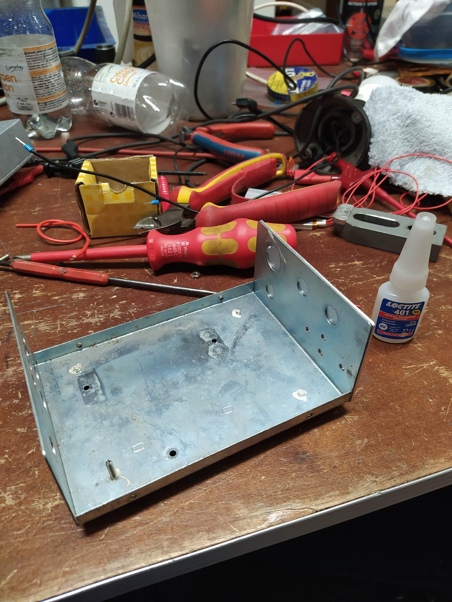
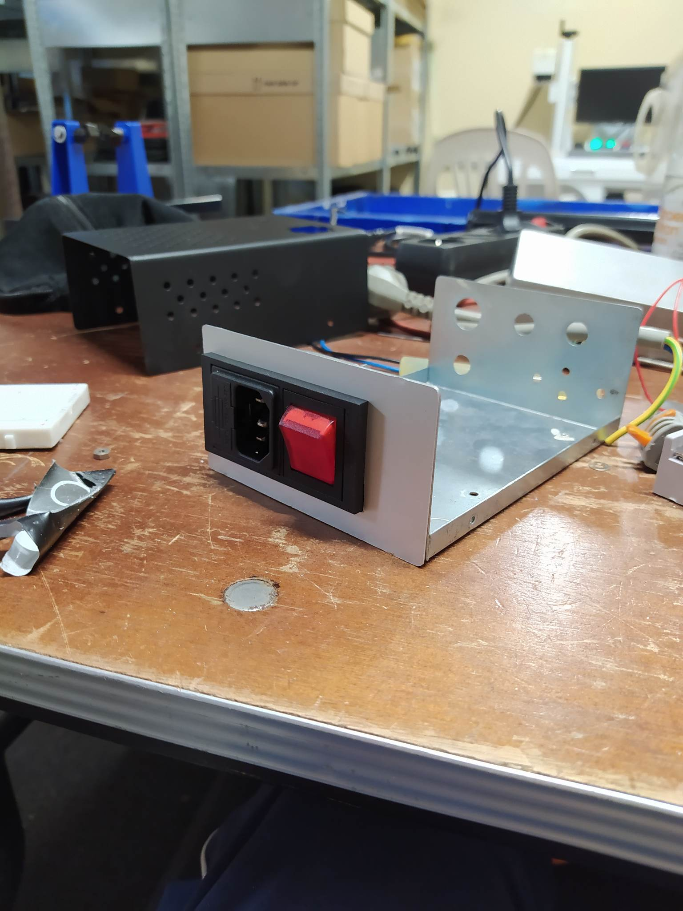

# PICO Reflow Plate v1
PICO Reflow Plate is a diy reflow plate based around a raspberry PI pico. The user is capable of adjusting the settings of the reflow curve like, preheat temperature, soak time, reflow temperature en reflow time.
## Usage:
- After  turning on the power the start menu will appear on the screen. 
#### Picture
- Selecting the setup menu will take you to the different adjustable parameters.
#### Picture
- After adjusting the parameters go back to the start menu en press start reflow. This will start te process.
#### Picture
- The current temperature, elapsed time and current state will be displayed on the screen during the reflow process.
#### Picture
- After the reflowing is done, the plate will go in to cooldown mode until the plate is below 50 degrees.
#### Picture

## Build:
### Hardware:
As casing I repurposed an old broken DC power supply.

  

As plate I used an 1590BB hammond enclosure where I used aluminum tape to position the NTC sensors, thermal paste to asure good thermal transfer and high heat silicone to keep everything in place.

  

For ease of use, I made a pin distribution board for the PICO wich also holds the resistors for the led and the thermistors. The PCB was lasered on a fiber laser.

  

Furthermore a solidstate relay is used to control the PTC elements, a 230V to 3.3V buck converter is used to power the PICO and an LED is added indicating when the hotplate is too hot too touch.
As user interface a SSD1306 display and a KY-040 rotary encoder with push button is used.

 

### Software:
## BOM:
## todo:
* finish readme
* fix power supply noise: 
  - add debouncing for rotary encoder? 
  - add filter btwn buck converter and PICO?
* write PID controller testcode
* write debounce testcode
* add bill of materials
* laser labels on enclosure
